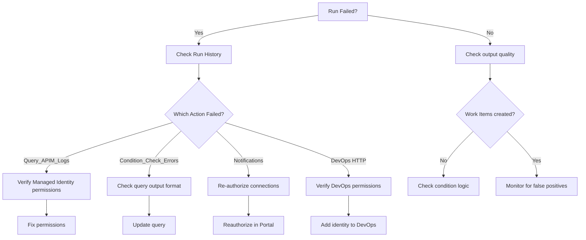

# Maintenance & Operations Guide

## Table of Contents
- [Daily Operations](#daily-operations)
- [Monitoring & Alerting](#monitoring--alerting)
- [Troubleshooting](#troubleshooting)
- [Update Procedures](#update-procedures)
- [Backup & Recovery](#backup--recovery)
- [Performance Tuning](#performance-tuning)
- [Security Maintenance](#security-maintenance)
- [Cost Management](#cost-management)

## Daily Operations

### Scheduled Execution
**Frequency**: Daily at 7:00 AM KST  
**Expected Duration**: 5-15 seconds  
**Success Criteria**: Run status "Succeeded"

### Health Check Routine
```bash
# Check last run status
az rest --method GET \
  --uri "https://management.azure.com/subscriptions/{sub-id}/resourceGroups/{rg}/providers/Microsoft.Logic/workflows/{logic-app-name}/runs?api-version=2016-06-01" \
  | jq '.value[0] | {status: .properties.status, startTime: .properties.startTime, endTime: .properties.endTime}'
```

**Expected Output**:
```json
{
  "status": "Succeeded",
  "startTime": "2026-01-03T22:00:00Z",
  "endTime": "2026-01-03T22:00:12Z"
}
```

### Action Verification
```bash
# Check each action status
az rest --method GET \
  --uri "https://management.azure.com/subscriptions/{sub-id}/resourceGroups/{rg}/providers/Microsoft.Logic/workflows/{logic-app-name}/runs/{run-id}/actions?api-version=2016-06-01" \
  | jq '.value[] | {name: .name, status: .properties.status}'
```

**Expected Actions**:
- ✅ Query_APIM_Logs: Succeeded
- ✅ Condition_Check_Errors: Succeeded
- ✅ Post_Teams_Notification: Succeeded (if errors detected)
- ✅ Send_Email_Alert: Succeeded (if errors detected)
- ✅ Create_DevOps_Work_Item_HTTP: Succeeded (if errors detected)

## Monitoring & Alerting

### Azure Monitor Integration

#### Configure Run Failure Alerts
```bash
# Create action group for notifications
az monitor action-group create \
  --name "LogicApp-Alerts" \
  --resource-group "{rg}" \
  --short-name "LA-Alert" \
  --email ops ops@example.com

# Create alert rule
az monitor metrics alert create \
  --name "LogicApp-Failed-Runs" \
  --resource-group "{rg}" \
  --scopes "/subscriptions/{sub-id}/resourceGroups/{rg}/providers/Microsoft.Logic/workflows/{logic-app-name}" \
  --condition "count RunsFailed > 0" \
  --window-size 1h \
  --evaluation-frequency 15m \
  --action "/subscriptions/{sub-id}/resourceGroups/{rg}/providers/Microsoft.Insights/actionGroups/LogicApp-Alerts"
```

### Application Insights (Optional)

#### Enable Diagnostic Settings
```bash
az monitor diagnostic-settings create \
  --name "LogicApp-Diagnostics" \
  --resource "/subscriptions/{sub-id}/resourceGroups/{rg}/providers/Microsoft.Logic/workflows/{logic-app-name}" \
  --workspace "/subscriptions/{sub-id}/resourceGroups/{rg}/providers/Microsoft.OperationalInsights/workspaces/{law-name}" \
  --logs '[{"category": "WorkflowRuntime", "enabled": true}]' \
  --metrics '[{"category": "AllMetrics", "enabled": true}]'
```

#### Query Execution Trends
```kusto
AzureDiagnostics
| where ResourceProvider == "MICROSOFT.LOGIC"
| where Category == "WorkflowRuntime"
| where status_s == "Failed"
| summarize FailureCount = count() by bin(TimeGenerated, 1d)
| render timechart
```

### Key Performance Indicators (KPIs)

| Metric | Target | Alert Threshold |
|--------|--------|-----------------|
| Success Rate | >95% | <90% |
| Execution Time | <30s | >60s |
| Query Latency | <5s | >10s |
| Error Detection Rate | N/A | Monitor for false positives |

## Troubleshooting

### Common Issues & Resolutions

#### Issue 1: Logic App Run Failed
**Symptom**: Run status shows "Failed"

**Diagnosis**:
```bash
# Get error details
az rest --method GET \
  --uri "https://management.azure.com/subscriptions/{sub-id}/resourceGroups/{rg}/providers/Microsoft.Logic/workflows/{logic-app-name}/runs/{run-id}?api-version=2016-06-01" \
  | jq '.properties.outputs'
```

**Common Causes**:
1. API connection expired (Teams, Outlook)
2. Managed Identity permissions revoked
3. Query syntax error
4. Timeout

**Resolution**:
- Re-authorize API connections
- Verify Managed Identity role assignments
- Test query in Log Analytics
- Increase timeout if needed

#### Issue 2: No Errors Detected (But Errors Exist)
**Symptom**: Workflow runs successfully but doesn't create Work Items when errors are present

**Diagnosis**:
```bash
# Check query action output
az rest --method GET \
  --uri "https://management.azure.com/subscriptions/{sub-id}/resourceGroups/{rg}/providers/Microsoft.Logic/workflows/{logic-app-name}/runs/{run-id}/actions/Query_APIM_Logs?api-version=2016-06-01" \
  | jq '.properties.outputs.body.tables[0].rows | length'
```

**Common Causes**:
1. Query time range too narrow
2. Log Analytics data not yet ingested
3. Query filtering too aggressive
4. Workspace ID incorrect

**Resolution**:
- Extend time range: `ago(24h)` → `ago(48h)`
- Wait 5-10 minutes for ingestion
- Review WHERE clause filters
- Verify Workspace ID in parameters

#### Issue 3: DevOps Work Item Not Created
**Symptom**: Logic App succeeds but no Work Item appears

**Diagnosis**:
```bash
# Check HTTP action response
az rest --method GET \
  --uri "https://management.azure.com/subscriptions/{sub-id}/resourceGroups/{rg}/providers/Microsoft.Logic/workflows/{logic-app-name}/runs/{run-id}/actions/Create_DevOps_Work_Item_HTTP?api-version=2016-06-01" \
  | jq '.properties.outputs'
```

**Common Causes**:
1. Managed Identity not granted DevOps permissions
2. Incorrect audience in authentication
3. DevOps project/organization name typo
4. API version incompatibility

**Resolution**:
```bash
# Verify Managed Identity has permissions
# Manual check in DevOps portal required

# Verify audience is correct
# Should be: 499b84ac-1321-427f-aa17-267ca6975798

# Test direct API call
TOKEN=$(az account get-access-token --resource 499b84ac-1321-427f-aa17-267ca6975798 --query accessToken -o tsv)
curl -H "Authorization: Bearer $TOKEN" \
  "https://dev.azure.com/{org}/{project}/_apis/wit/workitems?api-version=7.0"
```

#### Issue 4: Teams/Email Not Sent
**Symptom**: Notification actions skipped or failed

**Diagnosis**:
```bash
# Check action status
az rest --method GET \
  --uri "https://management.azure.com/subscriptions/{sub-id}/resourceGroups/{rg}/providers/Microsoft.Logic/workflows/{logic-app-name}/runs/{run-id}/actions?api-version=2016-06-01" \
  | jq '.value[] | select(.name | contains("Teams") or contains("Email")) | {name: .name, status: .properties.status, error: .properties.error}'
```

**Common Causes**:
1. API connection not authorized
2. Teams Channel ID changed
3. Email recipient invalid
4. Connection expired

**Resolution**:
- Re-authorize connections in Azure Portal
- Verify Channel ID: Teams → Channel → Get link → Extract ID
- Validate email address format
- Recreate connection if needed

### Debugging Workflow



## Update Procedures

### Modify Schedule
```bash
# Update parameters file
cat > schedule-update.json << EOF
{
  "scheduleHour": {
    "value": "9"
  }
}
EOF

# Deploy with updated schedule
az deployment group create \
  --resource-group "{rg}" \
  --template-file logicapp-deployment.json \
  --parameters @parameters.json \
  --parameters @schedule-update.json \
  --mode Incremental \
  --name "Schedule-Update-$(date +%Y%m%d%H%M%S)"
```

### Update Query Logic
```bash
# Edit template file
# Modify the KQL query in:
# resources[3].properties.definition.actions.Query_APIM_Logs.inputs.body.query

# Deploy update
az deployment group create \
  --resource-group "{rg}" \
  --template-file logicapp-deployment.json \
  --parameters @parameters.json \
  --mode Incremental
```

### Add New Notification Channel
1. Edit ARM template
2. Add new action in `actions` section
3. Update `runAfter` dependencies
4. Deploy via Azure CLI

### Change DevOps Assignee
```bash
# Update parameters file
{
  "devOpsAssignee": {
    "value": "new-assignee@example.com"
  }
}

# Re-deploy
az deployment group create \
  --resource-group "{rg}" \
  --template-file logicapp-deployment.json \
  --parameters @parameters.json \
  --mode Incremental
```

## Backup & Recovery

### Backup Strategy

#### 1. ARM Template Backup
```bash
# Export current configuration
az logic workflow show \
  --name "{logic-app-name}" \
  --resource-group "{rg}" \
  > backup-$(date +%Y%m%d).json
```

#### 2. Git Repository
- All templates stored in GitHub
- Version control via Git tags
- Branch protection enabled

#### 3. Parameters Backup
```bash
# Encrypt parameters file (contains sensitive data)
gpg --encrypt --recipient ops@example.com parameters.json

# Store encrypted file securely (Azure Key Vault, etc.)
az keyvault secret set \
  --vault-name "{keyvault-name}" \
  --name "logicapp-parameters" \
  --file parameters.json.gpg
```

### Recovery Procedures

#### Scenario 1: Accidental Deletion
```bash
# Re-deploy from Git
git clone https://github.com/zer0big/azure-secops-automation-demo.git
cd azure-secops-automation-demo

# Deploy
az deployment group create \
  --resource-group "{rg}" \
  --template-file logicapp-deployment.json \
  --parameters @parameters.json
```

#### Scenario 2: Corrupted Configuration
```bash
# Restore from backup
az deployment group create \
  --resource-group "{rg}" \
  --template-file backup-20260103.json \
  --mode Complete  # CAUTION: Overwrites existing
```

#### Scenario 3: Region Outage
```bash
# Deploy to alternate region
az deployment group create \
  --resource-group "{rg-dr}" \
  --template-file logicapp-deployment.json \
  --parameters location="westus2" \
  --parameters @parameters.json
```

## Performance Tuning

### Optimize Query Performance
```kusto
-- Current query (baseline)
ApiManagementGatewayLogs
| where TimeGenerated > ago(24h)
| where ResponseCode != 200
| take 50

-- Optimized query (with indexing hints)
ApiManagementGatewayLogs
| where TimeGenerated > ago(24h)
| where ResponseCode >= 400  -- More specific filter
| project-away Cache, Errors  -- Reduce data transfer
| take 50
```

### Reduce Execution Time
1. **Limit query results**: Use `take 50` instead of `take 100`
2. **Parallel actions**: Ensure notifications run in parallel
3. **Timeout settings**: Increase for slow queries

### Scale Considerations
- **Current Load**: 1 execution/day = negligible
- **Scaling to Hourly**: 24 executions/day = still low
- **Scaling to Multi-Region**: Deploy separate Logic App per region

## Security Maintenance

### Monthly Security Review

#### 1. Review Managed Identity Permissions
```bash
# List role assignments
az role assignment list \
  --assignee $(az logic workflow show --name "{logic-app-name}" --resource-group "{rg}" --query "identity.principalId" -o tsv) \
  --all -o table
```

**Expected Roles**:
- Log Analytics Reader (Workspace scope)
- (Manual) Work Item Writer (DevOps scope)

#### 2. Review API Connection Permissions
- Navigate to: Azure Portal → Connections
- Verify each connection (teams, outlook) has valid authorization
- Re-authorize if showing "Unauthorized"

#### 3. Audit Run History
```bash
# Check for unusual patterns
az rest --method GET \
  --uri "https://management.azure.com/subscriptions/{sub-id}/resourceGroups/{rg}/providers/Microsoft.Logic/workflows/{logic-app-name}/runs?api-version=2016-06-01&\$top=100" \
  | jq '.value | group_by(.properties.status) | map({status: .[0].properties.status, count: length})'
```

### Quarterly Security Tasks
- Rotate any manually managed secrets (if applicable)
- Review DevOps Work Item permissions
- Audit email recipients list
- Verify Teams channel access

## Cost Management

### Current Cost Profile
**Estimated Monthly Cost** (as of Jan 2026):

| Component | Usage | Unit Cost | Monthly Cost |
|-----------|-------|-----------|--------------|
| Logic App Executions | 30/month | $0.000025 | $0.00075 |
| Log Analytics Query | 30 queries | Included | $0 |
| API Connections | 3 connections | $0.05/connection | $0.15 |
| **Total** | | | **~$0.15/month** |

### Cost Optimization Tips
1. **Avoid frequent execution**: Daily is optimal
2. **Limit query results**: `take 50` reduces data transfer
3. **Use Managed Identity**: No Key Vault costs
4. **Monitor API connection usage**: Disconnect unused connectors

### Cost Monitoring
```bash
# View Logic App cost
az consumption usage list \
  --start-date 2026-01-01 \
  --end-date 2026-01-31 \
  --query "[?contains(instanceName, 'logicapp-apim-aoai-monitoring')]" \
  -o table
```

## Maintenance Checklist

### Daily
- [ ] Verify scheduled run completed successfully
- [ ] Check for error Work Items in DevOps

### Weekly
- [ ] Review run history for failures
- [ ] Verify notifications received (Teams/Email)

### Monthly
- [ ] Review Managed Identity permissions
- [ ] Check API connection authorization
- [ ] Audit query performance
- [ ] Review cost dashboard

### Quarterly
- [ ] Security review (permissions, access)
- [ ] Update documentation if changes made
- [ ] Performance optimization review
- [ ] Disaster recovery test

### Annually
- [ ] Full backup and recovery test
- [ ] Review and update alert thresholds
- [ ] Evaluate new Azure features for optimization

---

**Document Version**: 1.0  
**Last Updated**: January 3, 2026  
**Maintained By**: Azure SecOps Team
